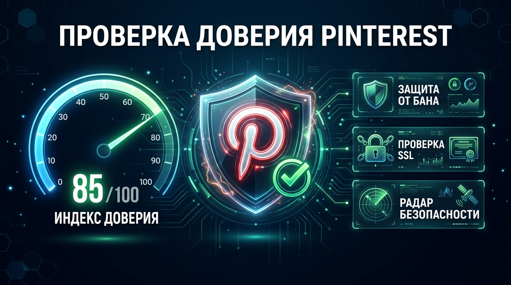
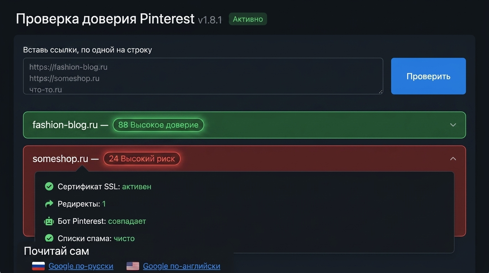
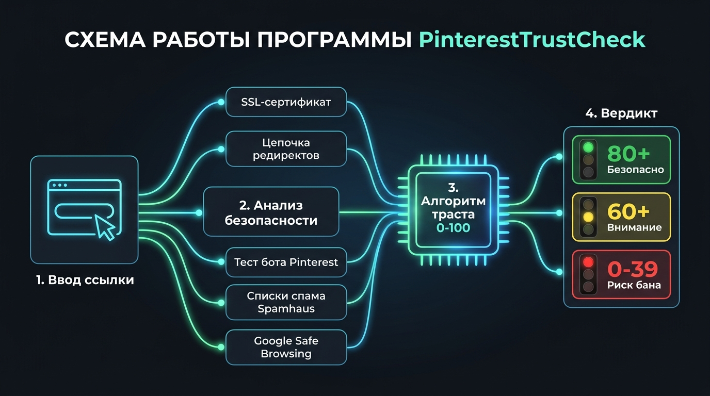

# Проверка доверия Pinterest к домену

Текущая версия: **v1.7.0** (номер виден на странице и по команде `--version`).

Простая программа для арбитража и продвижения в Pinterest.
Отвечает на главный вопрос: **стоит ли ставить этот домен в пины, или Pinterest обрежет показы.**

Важно честно: у Pinterest нет открытого счёта доверия. Это наш собственный индекс 0–100
по открытым сигналам. Зелёный 80+ — спокойно, жёлтый 60+ — следи за показами,
оранжевый 40+ — готовь запасной домен, красный — высокий риск блокировки ссылок.

## Запуск за 1 минуту (ничего ставить не надо)

1. Скачай архив `PinterestTrustCheck.zip` со страницы Releases и распакуй куда удобно
2. Два клика по `run-web.bat` — откроется тёмная страница в браузере
3. Вставь ссылки, по одной на строку, нажми «Проверить»

Другой способ: впиши ссылки в `links.txt` и запусти `run.bat` — получишь таблицу и файл `results.csv`.
Каждая проверка дописывается в историю с датой: видно, если домен со временем желтеет.

## Что проверяется (медленно, зато честно)

- Перебросы с адреса на адрес: Pinterest режет цепочки длиннее одного прыжка
- Сертификат и шифрование: битый или просроченный — почти всегда блок
- Скорость ответа: медленные сайты считаются подозрительными
- Возраст домена: к молодым Pinterest строже
- Взгляд бота: сравниваем, что видит человек и краулер Pinterest. Разное содержимое — признак маскировки, за неё банят
- Четыре чёрных списка спама: Spamhaus DBL, SURBL, URLhaus, URIBL
- Веб-архив: когда сайт впервые увидели. Паспорт говорит «старый», а в архиве его нет — значит, перекупался
- История сертификатов: первый и сколько их
- Жалобы OTX и вердикты VirusTotal — нужны бесплатные ключи (ниже)
- Хостинг и страна сети, страницы доверия (контакты, политика)
- Google Safe Browsing — нужен бесплатный ключ (ниже)

Строгость: бесплатный хостинг выше жёлтого не поднимется, молодым доменам режем потолок,
сокращалки, маскировка и чёрные списки — красная зона.

## Как выглядит

## Как это работает

## Ключи (не обязательны, но чем больше — тем тщательнее проверка)

В программе есть раздел «Ключи»: видно, что подключено (например, «2/3 подключено»),
ключ вставляется прямо там и сразу проверяется. Запасной путь — положить ключ одной
строкой в файл рядом с кнопками (`gsb.key`, `otx.key`, `vt.key`). Ключ — как пароль:
никому не показывай.

| Ключ | Что даёт | Где взять | Хватит ли лимита |
|---|---|---|---|
| Google Safe Browsing | Страховка: роняет в красный, если Google внёс ссылку в чёрный список | `console.cloud.google.com` → проект → Safe Browsing API → Включить → Учётные данные → Ключ API | Да, бесплатного хватает. Точную цифру смотри в консоли на вкладке Quotas |
| OTX | Число жалоб на домен в базе угроз | Регистрация на `otx.alienvault.com` → настройки → API Integration | Да, жёстких лимитов нет — просят просто не борзеть |
| VirusTotal | Вердикты антивирусных движков | Регистрация на `virustotal.com` → значок профиля → API key | Самый строгий: примерно 500 запросов в день и 4 в минуту. На десятки ссылок хватает; если упрёшься — программа напишет «лимит исчерпан» и пойдёт дальше |

Без ключей программа честно пишет «не проверено», а не делает вид, что всё чисто.

## Про антивирус

Вирусов здесь нет — весь код открыт в папке `cmd`, собирается из исходников кнопкой `install.bat`.
Но антивирусы иногда ворчат на любые неподписанные программы из интернета, которые ходят в сеть. Что делать:

- проверь архив на `virustotal.com` перед запуском;
- если твой антивирус ругнулся — добавь папку программы в исключения;
- самый надёжный путь: кнопка `install.bat` соберёт программу из открытого кода прямо у тебя на глазах.

## Вопросы и ответы

**Балл прыгает от замера к замеру — сломалось?**
Нет. Сайт отвечает по-разному: холодный старт даёт медленный ответ, цепочка перебросов может меняться.
История хранит расшифровку каждого замера — сравни строки и увидишь, какой пункт упал.

**Зелёный, а показы всё равно режут — почему?**
Балл — про домен и ссылку. Показы режут ещё за поведение аккаунта: массовый постинг, одинаковые картинки,
жалобы. Отличить одно от другого помогает проверка черновиком пина:

1. Зайди в Pinterest и нажми «Создать» → «Пин»
2. Загрузи любую картинку и придумай название
3. Найди поле «Ссылка» (адрес сайта) и вставь туда свой домен
4. Смотри, что скажет Pinterest прямо там, у поля ссылки:
   - пишет про спам или блокировку — дело в домене, такой в пины не ставь;
   - принял молча — домен пропустили, дальше вопрос к аккаунту и оформлению
5. Если принял — сохрани пин и глянь показы через пару дней. Показов нет при зелёном домене —
   разбирайся с аккаунтом: частота постинга, уникальность картинок, жалобы

**Можно ли улучшить точность?**
Да: держи ссылки чистыми (без сокращалок и меток), убери лишние перебросы, заведи свой домен вместо
бесплатного поддомена, добавь на посадку контакты и политику.

## Файлы рядом с кнопками

- `run-web.bat` — тёмный интерфейс в браузере (основное)
- `run.bat` — пакетная проверка из `links.txt`, итоги падают в `results.csv`
- `links.txt` — твои ссылки, по одной на строку
- `history.csv` — история проверок с датами (растёт сама)
- `gsb.key` — сюда ложится ключ Google после сохранения в программе

Пользуйся бесплатно для личных целей.
